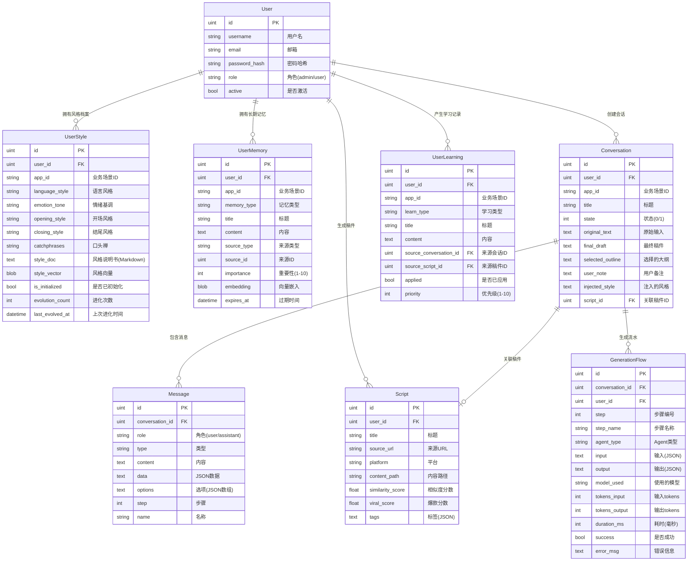

# content_creator_imm 用户记忆系统设计方案

## 概述

本文档描述如何在 content_creator_imm 项目中实现用户级别的记忆系统，参考 OpenClaw 的用户记忆设计，在用户对话时注入用户记忆的 context，实现更个性化的口播稿生成服务。

---

## 一、背景与目标

### 1.1 当前问题

content_creator_imm 当前只有 `UserStyle` 表存储用户风格档案，包含：
- 语言风格
- 情绪基调
- 开场风格
- 结尾风格
- 口头禅

**问题**：
1. 风格档案是静态的，无法随用户交互动态进化
2. 缺少长期记忆，无法记住用户的重要偏好和历史决策
3. 缺少短期记忆（会话记忆），无法在多轮对话中保持上下文连贯
4. 无法从用户反馈中学习和改进

### 1.2 设计目标

参考 OpenClaw 的记忆系统设计，实现：

1. **长期记忆**：记住用户的重要偏好、历史稿件风格、常见主题
2. **短期记忆**：会话级别的上下文记忆
3. **进化记忆**：从用户反馈中学习，持续优化风格档案
4. **记忆注入**：在 AI Prompt 中注入用户记忆 context

---

## 二、记忆层次设计

### 2.1 记忆层次结构

```
┌─────────────────────────────────────────────────────────────────────┐
│                    content_creator_imm 记忆层次                      │
├─────────────────────────────────────────────────────────────────────┤
│                                                                     │
│  ┌───────────────────────────────────────────────────────────────┐ │
│  │                   用户风格档案（UserStyle）                    │ │
│  │  语言风格、情绪基调、开场风格、结尾风格、口头禅                 │ │
│  │  【初始化时由风格建模师 Agent 生成，后续可手动调整】           │ │
│  └───────────────────────────────────────────────────────────────┘ │
│                              ↓                                      │
│  ┌───────────────────────────────────────────────────────────────┐ │
│  │                   长期记忆（UserMemory）                       │ │
│  │  精炼后的重要偏好、常用主题、历史稿件风格摘要                   │ │
│  │  【从会话记忆中提炼，每次会话加载】                            │ │
│  └───────────────────────────────────────────────────────────────┘ │
│                              ↓                                      │
│  ┌───────────────────────────────────────────────────────────────┐ │
│  │                   会话记忆（ConversationMemory）               │ │
│  │  当前会话的消息历史、大纲决策、修改偏好                        │ │
│  │  【会话开始时加载，会话结束时保存】                            │ │
│  └───────────────────────────────────────────────────────────────┘ │
│                              ↓                                      │
│  ┌───────────────────────────────────────────────────────────────┐ │
│  │                   进化记忆（UserLearning）                     │ │
│  │  用户反馈记录、风格调整建议、改进历史                          │ │
│  │  【从用户反馈中提取，定期分析生成改进建议】                    │ │
│  └───────────────────────────────────────────────────────────────┘ │
│                                                                     │
└─────────────────────────────────────────────────────────────────────┘
```

### 2.2 各层记忆职责

| 记忆层 | 数据类型 | 生命周期 | 更新时机 |
|--------|----------|----------|----------|
| UserStyle | 风格档案 | 永久 | 初始化时、用户手动调整 |
| UserMemory | 长期记忆 | 永久 | 每次会话结束时提炼 |
| ConversationMemory | 会话记忆 | 会话期间 | 会话中实时更新 |
| UserLearning | 进化记忆 | 永久 | 用户反馈时记录 |

---

## 三、数据模型设计

### 3.0 ER 图（整体架构）



**关系说明**：
- **User → UserStyle**：1:N（每个用户在每个 app_id 下有一个风格档案，联合唯一索引）
- **User → UserMemory**：1:N（每个用户在每个 app_id 下有多条长期记忆）
- **User → Conversation**：1:N（每个用户创建多个会话）
- **User → UserLearning**：1:N（每个用户产生多条学习记录）
- **User → Script**：1:N（每个用户生成多篇稿件）
- **Conversation → Message**：1:N（每个会话包含多条消息）
- **Conversation → Script**：1:1（每个完成的会话关联一篇稿件）

**业务场景隔离**：
- 所有核心表都包含 `app_id` 字段
- 查询时通过 `(user_id, app_id)` 联合索引过滤
- 不同业务场景的记忆完全隔离

### 3.1 新增表结构

#### UserMemory（长期记忆表）

```go
// 长期记忆表
type UserMemory struct {
    ID          uint      `gorm:"primaryKey" json:"id"`
    UserID      uint      `gorm:"index;not null" json:"user_id"`
    
    // 业务场景隔离
    AppID       string    `gorm:"size:64;index;not null" json:"app_id"`
    // 例如："oral_script"（口播稿）、"video_script"（短视频脚本）、"article"（文章）
    // 不同业务场景的记忆完全隔离
    
    // 记忆类型
    MemoryType  string    `gorm:"size:32;not null" json:"memory_type"` 
    // preference（偏好）, topic（常用主题）, style_note（风格备注）, 
    // history_summary（历史摘要）, important_fact（重要事实）
    
    // 记忆内容
    Title       string    `gorm:"size:256" json:"title"`
    Content     string    `gorm:"type:text" json:"content"`
    
    // 元数据
    SourceType  string    `gorm:"size:32" json:"source_type"`   // conversation/feedback/manual
    SourceID    *uint     `json:"source_id"`                    // 关联的会话或反馈ID
    
    // 重要性评分（用于检索排序）
    Importance  int       `gorm:"default:5" json:"importance"`  // 1-10
    
    // 向量嵌入（用于语义搜索）
    Embedding   []byte    `gorm:"type:blob" json:"-"`           // JSON编码的float32数组
    
    CreatedAt   time.Time `json:"created_at"`
    UpdatedAt   time.Time `json:"updated_at"`
    ExpiresAt   *time.Time `json:"expires_at"`                  // 可选的过期时间
}

// 联合索引：用户 + 业务场景
// db.Model(&UserMemory{}).AddIndex("idx_user_app", "user_id", "app_id")
```

#### Conversation 表扩展（而非新建 ConversationMemory）

> **设计决策**：现有 Message 表已存储完整会话历史，不需要新建 ConversationMemory 表。
> 只需扩展 Conversation 表存储会话级别的上下文信息。

```go
// Conversation 表扩展字段
type Conversation struct {
    ID              uint      `gorm:"primaryKey" json:"id"`
    UserID          uint      `gorm:"index;not null" json:"user_id"`
    
    // 业务场景隔离
    AppID           string    `gorm:"size:64;index;not null" json:"app_id"`
    
    Title           string    `gorm:"size:200" json:"title"`
    State           int       `gorm:"default:0" json:"state"`     // 0=进行中/1=完成
    
    // 新增字段：会话级别的上下文
    OriginalText    string    `gorm:"type:text" json:"original_text"`     // 原始输入
    FinalDraft      string    `gorm:"type:text" json:"final_draft"`       // 最终稿件
    SelectedOutline string    `gorm:"type:text" json:"selected_outline"`  // 用户选择的大纲(JSON)
    UserNote        string    `gorm:"type:text" json:"user_note"`         // 用户备注
    InjectedStyle   string    `gorm:"type:text" json:"injected_style"`    // 注入的风格context摘要
    
    // 现有关联
    ScriptID        *uint     `gorm:"index" json:"script_id"`             // 关联的稿件ID
    
    CreatedAt       time.Time `json:"created_at"`
    UpdatedAt       time.Time `json:"updated_at"`
}

// 联合索引：用户 + 业务场景
// db.Model(&Conversation{}).AddIndex("idx_user_app", "user_id", "app_id")
```

**会话记忆加载**：按业务场景过滤
```sql
SELECT * FROM messages 
WHERE conversation_id = ? 
ORDER BY id ASC
```

**优势**：
- 复用现有表结构，减少冗余
- Message 表已实现实时落库，会话恢复无缝
- 业务场景隔离：每个会话属于一个特定的业务场景
- 无需迁移现有数据（可设置默认 app_id）

#### UserLearning（进化记忆表）

```go
// 进化记忆表
type UserLearning struct {
    ID          uint      `gorm:"primaryKey" json:"id"`
    UserID      uint      `gorm:"index;not null" json:"user_id"`
    
    // 业务场景隔离
    AppID       string    `gorm:"size:64;index;not null" json:"app_id"`
    
    // 学习类型
    LearnType   string    `gorm:"size:32;not null" json:"learn_type"`
    // feedback（用户反馈）, adjustment（风格调整）, insight（洞察）, 
    // error（错误记录）, improvement（改进建议）
    
    // 内容
    Title       string    `gorm:"size:256" json:"title"`
    Content     string    `gorm:"type:text" json:"content"`
    
    // 来源
    SourceConversationID *uint `json:"source_conversation_id"`
    SourceScriptID       *uint `json:"source_script_id"`
    
    // 状态
    Applied     bool      `gorm:"default:false" json:"applied"`    // 是否已应用到风格档案
    Priority    int       `gorm:"default:5" json:"priority"`       // 1-10
    
    CreatedAt   time.Time `json:"created_at"`
    UpdatedAt   time.Time `json:"updated_at"`
}

// 联合索引：用户 + 业务场景
// db.Model(&UserLearning{}).AddIndex("idx_user_app", "user_id", "app_id")
```

#### GenerationFlow（生成流水表）

> **用途**：记录口播稿生成流程中每一步的完整输入输出和中间产物，用于流程追踪、效果分析、优化改进、审计回溯。

```go
// 生成流水表
type GenerationFlow struct {
    ID              uint      `gorm:"primaryKey" json:"id"`
    ConversationID  uint      `gorm:"index;not null" json:"conversation_id"`
    UserID          uint      `gorm:"index;not null" json:"user_id"`
    
    // 步骤信息
    Step            int       `gorm:"not null" json:"step"`           // 步骤编号(0-10)
    StepName        string    `gorm:"size:64;not null" json:"step_name"` 
    AgentType       string    `gorm:"size:64" json:"agent_type"`      // Agent类型
    
    // ===== 完整输入 =====
    InputPrompt     string    `gorm:"type:longtext" json:"input_prompt"`   // 发送给AI的完整prompt
    InputContext    string    `gorm:"type:text" json:"input_context"`      // 注入的context摘要（风格+记忆）
    InputParams     string    `gorm:"type:text" json:"input_params"`       // 其他参数(JSON)
    
    // ===== 完整输出（所有产物）=====
    OutputRaw       string    `gorm:"type:longtext" json:"output_raw"`     // AI原始返回（未解析）
    OutputParsed    string    `gorm:"type:text" json:"output_parsed"`      // 解析后的结构化数据(JSON)
    OutputDraft     string    `gorm:"type:longtext" json:"output_draft"`   // 生成的文稿/大纲内容
    OutputMeta      string    `gorm:"type:text" json:"output_meta"`        // 输出元数据(JSON)
    // 例如：{"outline_count": 2, "word_count": 1500, "sections": ["开头", "主体", "结尾"]}
    
    // ===== 元数据 =====
    ModelUsed       string    `gorm:"size:64" json:"model_used"`      // 使用的模型(如 "glm-4")
    TokensInput     int       `json:"tokens_input"`                   // 输入tokens
    TokensOutput    int       `json:"tokens_output"`                  // 输出tokens
    DurationMs      int       `json:"duration_ms"`                    // 耗时(毫秒)
    Success         bool      `gorm:"default:true" json:"success"`    // 是否成功
    ErrorMsg        string    `gorm:"type:text" json:"error_msg"`     // 错误信息
    
    CreatedAt       time.Time `json:"created_at"`
}

// 索引：会话 + 步骤（唯一）
// db.Model(&GenerationFlow{}).AddUniqueIndex("idx_conv_step_unique", "conversation_id", "step")
```

**字段说明**：

| 字段 | 说明 | 存储格式 |
|------|------|----------|
| `input_prompt` | 发送给 AI 的完整 Prompt | 纯文本（Markdown） |
| `input_context` | 注入的用户风格 + 记忆 context | 纯文本（Markdown） |
| `input_params` | 其他参数（温度、max_tokens 等） | JSON |
| `output_raw` | AI 原始返回（未处理） | 纯文本 |
| `output_parsed` | 解析后的结构化数据 | JSON |
| `output_draft` | 生成的文稿/大纲内容 | 纯文本（Markdown） |
| `output_meta` | 输出元数据（字数、段落数等） | JSON |

**生成流程步骤定义**：

| Step | StepName | AgentType | 输入产物 | 输出产物 |
|------|----------|-----------|----------|----------|
| 0 | input_receive | - | - | 用户原始文本、提取的关键信息 |
| 1 | style_analysis | StyleModeler | 用户历史稿件、原始文本 | 风格分析报告、风格标签 |
| 2 | outline_generate | OutlineGenerator | 原始文本 + 风格 context | 3-5 个大纲选项 |
| 3 | outline_select | - | 大纲选项 | 用户选择的大纲 ID |
| 4 | script_generate | ScriptWriter | 选择的大纲 + 风格 context | 口播稿初稿 |
| 5 | similarity_check | SimilarityChecker | 口播稿初稿 | 相似度报告（相似稿件列表） |
| 6 | script_modify | ScriptWriter | 用户修改指令 + 当前稿件 | 修改后的稿件 |
| 7 | complete | - | 最终稿件 | 完成标记、最终统计 |

**完整流水记录示例**：

```json
// Step 2: outline_generate（大纲生成）
{
  "step": 2,
  "step_name": "outline_generate",
  "agent_type": "OutlineGenerator",
  
  // 输入
  "input_prompt": "你是一位专业的大纲生成助手...\n\n用户风格：财经风格，数据驱动...\n\n原始文本：分析一下AI行业的投资机会...",
  "input_context": "## 用户风格档案\n- 语言风格：简洁有力\n- 情绪基调：理性客观\n\n## 用户偏好记忆\n- 喜欢用'XX概念'作为标题格式\n- 常见主题：财经分析",
  "input_params": "{\"temperature\": 0.7, \"max_tokens\": 2000}",
  
  // 输出
  "output_raw": "根据用户风格和原始文本，我为您生成了3个大纲选项...",
  "output_parsed": "{\"outlines\": [{\"id\": 1, \"title\": \"AI行业投资全景分析\", \"sections\": [...]}, {...}]}",
  "output_draft": "# 大纲选项\n\n## 方案1：AI行业投资全景分析\n1. 行业现状：市场规模与增长趋势\n2. 投资逻辑：核心赛道与龙头公司\n3. 风险提示：政策与技术风险\n\n## 方案2：典型案例驱动分析\n...",
  "output_meta": "{\"outline_count\": 3, \"total_word_count\": 500}",
  
  // 元数据
  "model_used": "glm-4",
  "tokens_input": 800,
  "tokens_output": 500,
  "duration_ms": 2500,
  "success": true
}
```

**用途场景**：

1. **流程回溯**：查看整个生成过程，每个步骤的输入输出
2. **效果分析**：分析每个 Agent 的生成效果，优化 Prompt
3. **成本统计**：统计 token 消耗，优化成本
4. **问题诊断**：失败时查看完整输入输出，定位问题
5. **记忆提炼**：从流水记录中提取用户偏好，写入 UserMemory

### 3.3 修改现有表结构

#### UserStyle（扩展字段 + 业务场景隔离）

```go
// 用户风格档案（扩展现有表）
type UserStyle struct {
    ID              uint      `gorm:"primaryKey" json:"id"`
    UserID          uint      `gorm:"index;not null" json:"user_id"`
    
    // 业务场景隔离
    AppID           string    `gorm:"size:64;index;not null" json:"app_id"`
    // 每个用户在每个业务场景下可以有独立的风格档案
    
    // 现有字段
    LanguageStyle   string    `gorm:"type:text" json:"language_style"`
    EmotionTone     string    `gorm:"type:text" json:"emotion_tone"`
    OpeningStyle    string    `gorm:"type:text" json:"opening_style"`
    ClosingStyle    string    `gorm:"type:text" json:"closing_style"`
    Catchphrases    string    `gorm:"type:text" json:"catchphrases"`
    
    // 新增字段
    StyleDoc        string    `gorm:"type:longtext" json:"style_doc"`       // 《人设风格说明书》完整文档
    StyleVector     []byte    `gorm:"type:blob" json:"-"`                   // 风格向量（用于相似度匹配）
    IsInitialized   bool      `gorm:"default:false" json:"is_initialized"`  // 是否已完成初始化
    
    // 进化相关
    EvolutionCount  int       `gorm:"default:0" json:"evolution_count"`     // 进化次数
    LastEvolvedAt   *time.Time `json:"last_evolved_at"`                     // 上次进化时间
    
    CreatedAt       time.Time `json:"created_at"`
    UpdatedAt       time.Time `json:"updated_at"`
}

// 联合唯一索引：用户 + 业务场景 = 一个风格档案
// db.Model(&UserStyle{}).AddUniqueIndex("idx_user_app_unique", "user_id", "app_id")
```

---

## 四、记忆注入机制

### 4.1 Prompt 注入流程

```
用户发起对话（携带 app_id）
    ↓
1. 加载 UserStyle（风格档案）
   WHERE user_id = ? AND app_id = ?
    ↓
2. 加载 UserMemory（长期记忆，按重要性排序，限制 tokens）
   WHERE user_id = ? AND app_id = ?
    ↓
3. 加载 ConversationMemory（当前会话上下文）
   从 Message 表读取当前会话历史
    ↓
4. 构建 Context Block
   ┌────────────────────────────────────┐
   │ ## 用户风格档案                     │
   │ {style_doc}                        │
   │                                    │
   │ ## 用户偏好记忆                     │
   │ {user_memories}                    │
   │                                    │
   │ ## 当前会话上下文                   │
   │ {conversation_context}             │
   └────────────────────────────────────┘
    ↓
5. 注入到 AI Prompt
    ↓
6. 生成口播稿
```

### 4.2 业务场景隔离示意

```
用户 A:
├── app_id = "oral_script"（口播稿）
│   ├── UserStyle: 财经风格、数据驱动
│   ├── UserMemory: 偏好财经分析、常用主题投资理财
│   └── Conversations: 10 篇财经口播稿
│
└── app_id = "video_script"（短视频脚本）
    ├── UserStyle: 娱乐风格、幽默轻松
    ├── UserMemory: 偏好搞笑段子、常用主题娱乐八卦
    └── Conversations: 5 篇娱乐脚本

两个场景的记忆完全独立，互不影响
```

### 4.2 Context Block 示例

```markdown
## 用户风格档案

你是一位财经类口播稿创作者，风格特点：
- 语言风格：简洁有力，数据驱动，善用比喻
- 情绪基调：理性客观，偶尔幽默
- 开场风格：直接切入主题，常用"今天聊聊..."
- 结尾风格：总结要点，引导互动
- 口头禅："咱们看数据"、"说白了就是"

## 用户偏好记忆

1. [偏好] 喜欢用"XX概念"作为标题格式
2. [主题] 常见主题：财经分析、科技趋势、投资理财
3. [备注] 之前生成的稿件中，"深度解析"类稿件反馈最好
4. [历史] 最近5篇稿件平均相似度18%，用户满意度高

## 当前会话上下文

原始输入：分析一下AI行业的投资机会
已选择大纲：方案1（全面分析型）
用户备注：重点讲讲大模型领域
```

### 4.3 Token 限制策略

为避免 context 过长，采用分层限制：

| 记忆层 | 最大 Tokens | 优先级 |
|--------|-------------|--------|
| UserStyle | 500 | 最高（必须包含） |
| UserMemory | 800 | 高（按重要性截取） |
| ConversationMemory | 500 | 中（当前会话） |
| **总计** | **1800** | - |

---

## 五、记忆更新机制

### 5.1 会话结束时更新

```
会话完成
    ↓
1. 提取关键信息
   - 用户选择的大纲类型
   - 用户修改的内容
   - 相似度结果
   - 用户满意度（如有反馈）
    ↓
2. 判断是否需要写入 UserMemory
   - 新的主题偏好？
   - 新的风格偏好？
   - 重要的历史记录？
    ↓
3. 写入 UserLearning
   - 记录本次会话的洞察
   - 为后续进化提供素材
    ↓
4. 更新 ConversationMemory 状态
```

### 5.2 长期记忆提炼

定期（或每 N 次会话后）运行提炼任务：

```
1. 读取最近 N 次会话的 ConversationMemory
    ↓
2. 调用 LLM 分析，提取：
   - 重复出现的偏好
   - 用户常见主题
   - 风格调整趋势
    ↓
3. 写入 UserMemory
   - 合并相似的偏好
   - 删除过时的记忆
   - 更新重要性评分
```

### 5.3 风格进化闭环

```
用户反馈（点赞/修改/投诉）
    ↓
记录到 UserLearning
    ↓
定期分析（每周/每10次反馈）
    ↓
生成风格调整建议
    ↓
应用到 UserStyle
    ↓
记录进化历史
```

---

## 六、API 设计

### 6.1 记忆读写 API

```yaml
# 风格档案（按业务场景隔离）
GET    /api/user/style
       # 获取用户风格档案
       # Query: app_id (必填)

PUT    /api/user/style
       # 更新用户风格档案
       # Request: { "app_id": "oral_script", "language_style": "...", ... }

# 长期记忆（按业务场景隔离）
GET    /api/user/memories
       # 获取用户长期记忆列表
       # Query: app_id (必填), type, limit, offset

POST   /api/user/memories
       # 手动添加长期记忆
       # Request: { "app_id": "oral_script", "memory_type": "preference", "title": "...", "content": "..." }

PUT    /api/user/memories/:id
       # 更新长期记忆

DELETE /api/user/memories/:id
       # 删除长期记忆

# 会话记忆（内部使用，通过 conversation 关联 app_id）
GET    /api/conversations/:id/memory
       # 获取会话记忆

# 进化记忆（按业务场景隔离）
GET    /api/user/learnings
       # 获取用户学习记录
       # Query: app_id (必填), type, limit, offset

POST   /api/user/learnings
       # 记录用户反馈
       # Request: { "app_id": "oral_script", "learn_type": "feedback", "content": "..." }

# 风格进化（按业务场景隔离）
POST   /api/user/style/evolve
       # 触发风格进化（手动）
       # Request: { "app_id": "oral_script" }
       # 返回：进化报告
```

### 6.2 记忆搜索 API

```yaml
POST   /api/user/memories/search
       # 语义搜索用户记忆
       # Request: { "app_id": "oral_script", "query": "财经分析", "limit": 5 }
       # Response: { "results": [...], "total": 10 }
```

### 6.3 会话 API（扩展）

```yaml
# 创建会话时指定业务场景
POST   /api/chat/reset
       # 重置会话
       # Request: { "app_id": "oral_script" }
       # 返回：{ "conv_id": 123 }

# 发送消息时关联业务场景
POST   /api/chat/message
       # 发送消息，SSE 流式响应
       # Request: { "content": "...", "app_id": "oral_script" }
```

---

## 七、实现路线图

### Phase 1: 基础记忆存储（1周）

- [ ] 创建 UserMemory 表
- [ ] 创建 ConversationMemory 表
- [ ] 实现基础 CRUD API
- [ ] 修改现有会话流程，写入 ConversationMemory

### Phase 2: 记忆注入（1周）

- [ ] 实现 Context Block 构建逻辑
- [ ] 实现 Token 限制策略
- [ ] 修改 Prompt 构建，注入记忆 context
- [ ] 测试记忆注入效果

### Phase 3: 记忆提炼（1周）

- [ ] 创建 UserLearning 表
- [ ] 实现会话结束时的记忆提取
- [ ] 实现定期提炼任务
- [ ] 实现记忆去重和过期清理

### Phase 4: 风格进化（1周）

- [ ] 扩展 UserStyle 表字段
- [ ] 实现用户反馈记录
- [ ] 实现风格进化分析
- [ ] 实现进化闭环

### Phase 5: 语义搜索（可选，1周）

- [ ] 实现向量嵌入
- [ ] 实现语义搜索
- [ ] 优化记忆检索效果

---

## 八、参考资源

- OpenClaw 记忆设计: `/data/code/openclaw-memory-system-design.md`
- content_creator_imm 现有架构: `/data/code/content_creator_imm/CLAUDE.md`
- 项目记忆索引: `/data/code/content_creator_imm/.ai_mem/`

---

*文档创建时间: 2026-03-31*
*作者: AI Assistant*